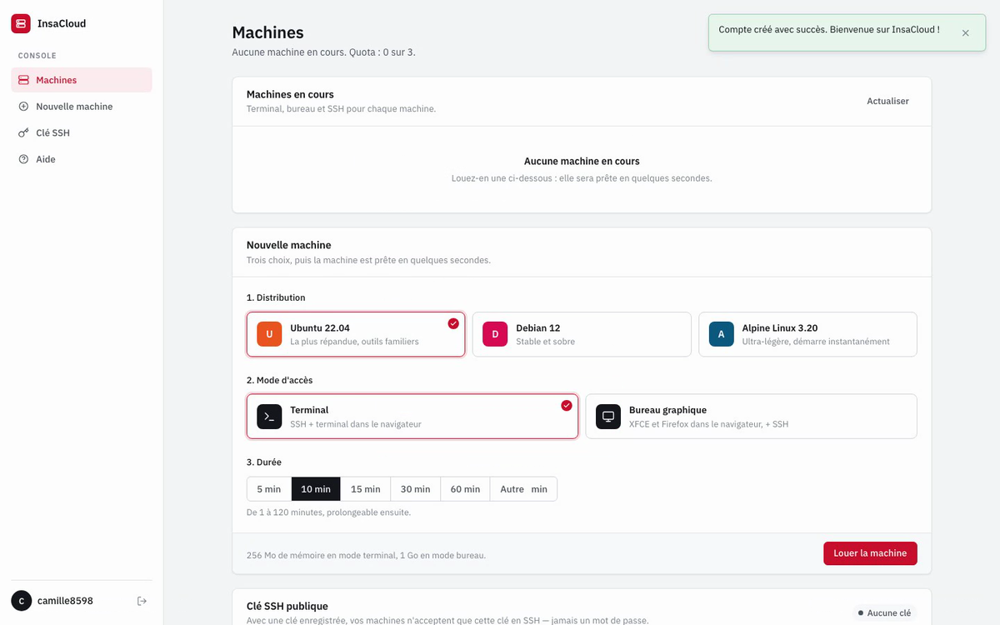
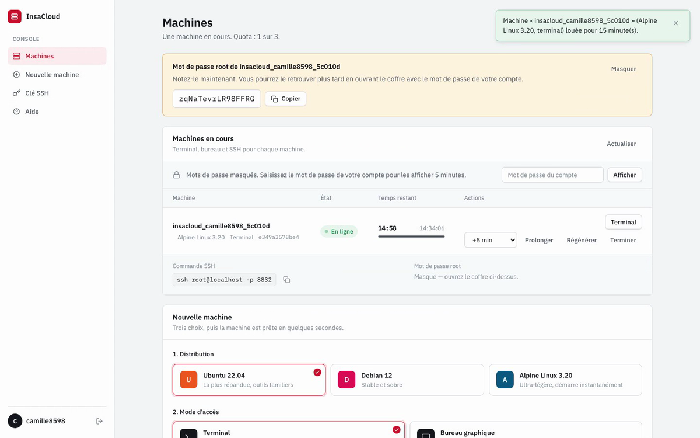
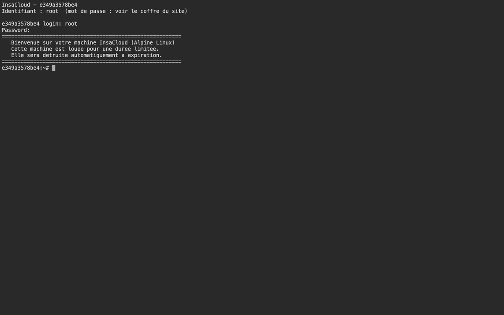
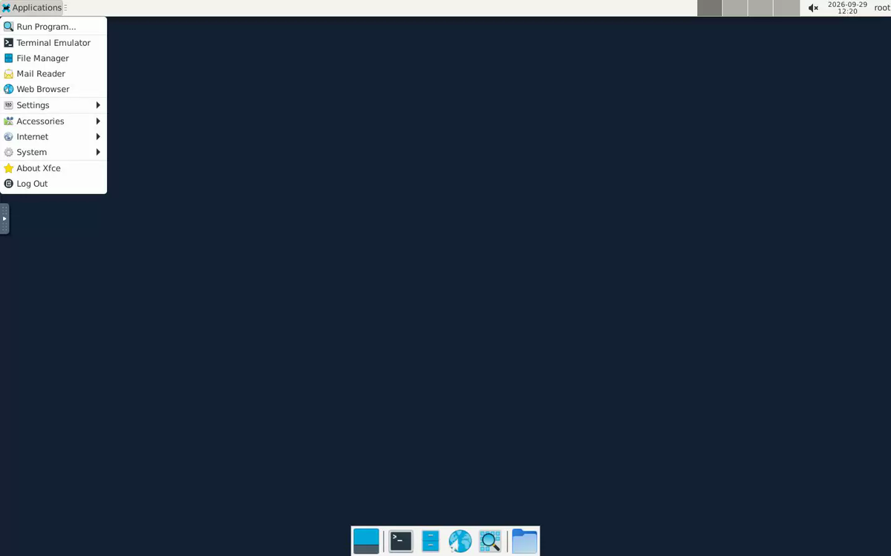
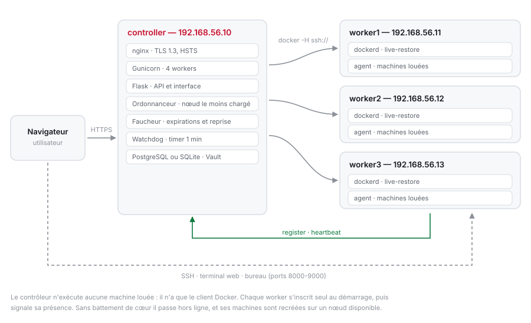
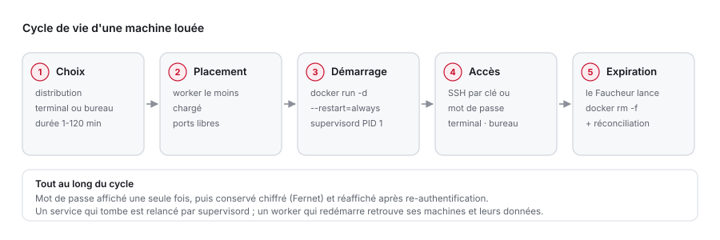
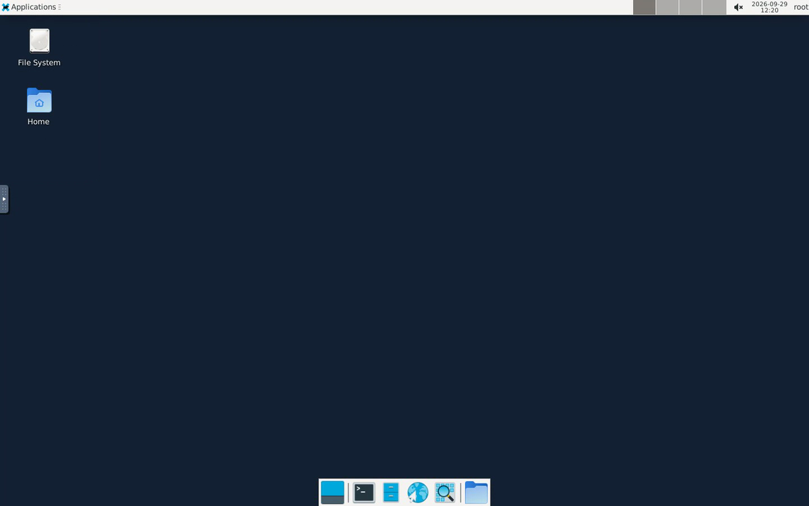
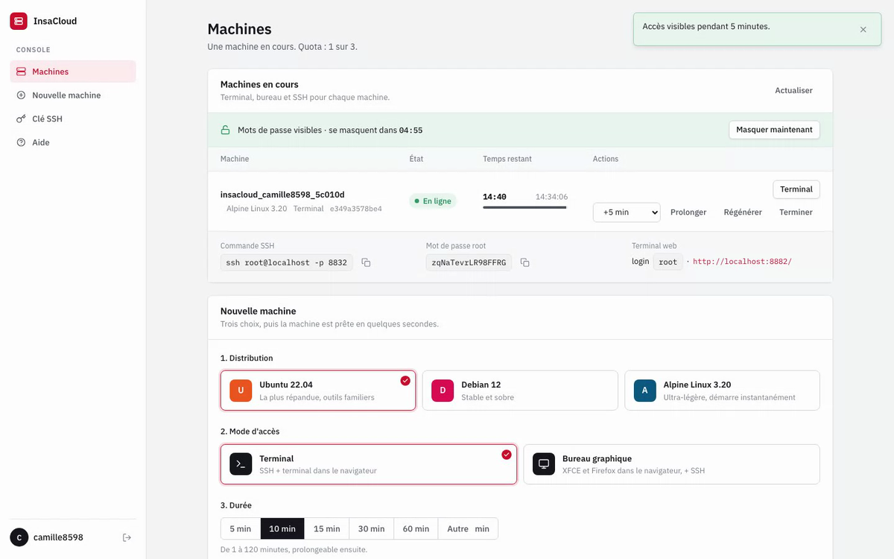

<h1 align="center">InsaCloud</h1>

<p align="center">
  <strong>Un mini-fournisseur de cloud, construit de zéro.</strong><br>
  Louez une machine Linux à la minute, travaillez dedans depuis votre navigateur,<br>
  et laissez-la se détruire toute seule à l'expiration.
</p>

<p align="center">
  
  
  
  
  
  
  
</p>

<p align="center">
  <a href="https://github.com/aziz3r/insacloud/actions/workflows/ci.yml">
    
  </a>
  
  
  
</p>

---

## La démo en 2 minutes

**▶ [Regarder la vidéo](docs/demo.mp4)** — tout le parcours, enregistré sur l'application réelle : création de compte, location d'une machine Alpine, terminal dans le navigateur, location d'un bureau Debian, XFCE en ligne, prolongation, fin de location.

<table>
<tr>
<td width="50%"></td>
<td width="50%"></td>
</tr>
<tr>
<td><b>Louer une machine en trois choix</b><br><sub>Distribution, mode d'accès, durée. Elle est prête en quelques secondes.</sub></td>
<td><b>Le mot de passe root s'affiche une seule fois</b><br><sub>Ensuite il est chiffré ; le revoir demande de ressaisir son propre mot de passe.</sub></td>
</tr>
<tr>
<td></td>
<td></td>
</tr>
<tr>
<td><b>Un terminal, sans rien installer</b><br><sub>Invite de connexion classique, servie en TLS par la machine elle-même.</sub></td>
<td><b>Ou un bureau complet</b><br><sub>XFCE et Firefox diffusés dans le navigateur par noVNC.</sub></td>
</tr>
</table>

## Pourquoi c'est intéressant

Derrière une interface volontairement simple, le projet répond à des questions que se pose n'importe quelle plateforme d'hébergement :

- **Où placer une nouvelle machine ?** Un contrôleur répartit les conteneurs sur le worker le moins chargé et pilote leur Docker à distance, sans jamais exposer d'API Docker sur le réseau.
- **Comment ne pas perdre l'état ?** Les machines survivent au redémarrage du démon Docker *et* de leur hôte, avec les données de l'utilisateur.
- **Comment gérer des secrets qu'on doit pouvoir réafficher ?** Le mot de passe root n'est jamais stocké en clair, et sa consultation exige une re-authentification limitée dans le temps.
- **Comment garantir que le service se relève seul ?** Un watchdog vérifie chaque minute le site, le nettoyeur et le proxy, et redémarre ce qui est tombé.
- **Comment reconstruire toute l'infrastructure à l'identique ?** Trois VM et un playbook idempotent : `vagrant up` puis `ansible-playbook`, et rien d'autre.

## Architecture

<picture>
  <source media="(prefers-color-scheme: dark)" srcset="docs/architecture-dark.svg">
  
</picture>

Le **contrôleur** sert le site et décide ; il n'exécute aucun conteneur loué et n'a même pas de démon Docker, seulement le client. Il pilote les **workers** par SSH (`docker -H ssh://insacloud@worker1`), avec une clé dédiée et un compte sans mot de passe. Les utilisateurs, eux, joignent directement leur machine sur le worker : SSH, terminal web, bureau.

Sans worker dans l'inventaire, tout retombe automatiquement sur une seule machine — pratique pour développer.

## Le cycle de vie d'une machine

<picture>
  <source media="(prefers-color-scheme: dark)" srcset="docs/cycle-de-vie-dark.svg">
  
</picture>

## Ce qu'on peut louer

|  | Terminal | Bureau graphique |
|---|---|---|
| **Ubuntu 22.04** | SSH + terminal web | + XFCE et Firefox |
| **Debian 12** | SSH + terminal web | + XFCE et Firefox |
| **Alpine 3.20** | SSH + terminal web | + XFCE et Firefox |
| Mémoire | 256 Mo | 1 Go |
| Taille de l'image | 118 – 303 Mo | 1,3 – 1,5 Go |

Six images, construites depuis trois Dockerfiles : la variante bureau s'active par un simple `--build-arg DESKTOP=1`, et un script d'entrée commun configure les services selon le mode.



## Sous le capot

<details>
<summary><b>Haute disponibilité à deux niveaux</b></summary>

Dans chaque machine, `supervisord` tourne en PID 1 et surveille ses services (sshd, terminal web, serveur d'affichage, bureau, noVNC) : si l'un meurt, il le relance. Si supervisord lui-même s'arrête, Docker relance le conteneur grâce à `--restart=always`. Enfin, le démon Docker des workers est en `live-restore` : une mise à jour de Docker ne coupe pas les machines en cours.

Vérifié en conditions réelles : un worker entièrement redémarré retrouve ses machines **et** les fichiers créés dedans.
</details>

<details>
<summary><b>Le « Faucheur » : un démon qui nettoie</b></summary>

Un service séparé lit la base toutes les dix secondes et détruit les machines dont la date de fin est dépassée. La détection tient en une requête SQL — les dates sont stockées au format de `datetime('now')`, ce qui rend la comparaison native.

Il fait aussi de la **réconciliation** : un conteneur présent sur un worker mais inconnu de la base est supprimé, une machine enregistrée dont le conteneur a disparu passe à « arrêtée ». Un worker injoignable est ignoré, jamais interprété comme une disparition.
</details>

<details>
<summary><b>Des secrets qu'on peut revoir sans les stocker en clair</b></summary>

Le mot de passe root est tiré au sort (16 caractères, ~90 bits), montré une fois, puis chiffré avec Fernet — la clé vient du Vault Ansible et ne se trouve jamais dans la base. Pour le réafficher, l'utilisateur ressaisit **son** mot de passe de compte : le coffre s'ouvre cinq minutes, puis se reverrouille.

Un bouton permet aussi de régénérer le mot de passe à chaud : SSH, terminal web et bureau prennent le nouveau immédiatement. Et si l'utilisateur enregistre sa clé SSH publique, ses machines n'acceptent plus que cette clé.


</details>

<details>
<summary><b>Ce que la plateforme refuse de faire</b></summary>

Chaque conteneur démarre avec `--cap-drop ALL` puis les dix capacités strictement nécessaires, `no-new-privileges`, une limite de processus et de CPU. Le serveur d'affichage n'écoute que sur la boucle locale ; terminal web et bureau sont chiffrés avec le certificat du nœud.

Côté site : jetons CSRF sur tous les formulaires, verrouillage après cinq échecs de connexion, politique de mot de passe, cookies `Secure`/`HttpOnly`/`SameSite=Strict`, et une CSP `default-src 'self'` — donc aucun CDN, aucun script en ligne : Tailwind est précompilé et les polices sont auto-hébergées.
</details>

<details>
<summary><b>Une infrastructure reproductible</b></summary>

`Vagrantfile` multi-provider (VMware, Parallels, QEMU pour Apple Silicon, VirtualBox en repli) décrivant un contrôleur et trois workers. Puis neuf rôles Ansible : pare-feu, clé de pilotage, Docker, certificats, workers, images, agent, proxy TLS, application. Quatre playbooks permettent de n'en rejouer qu'une partie — `docker.yml`, `worker.yml`, `deploy.yml` — sans tout reprendre.

Le playbook est **idempotent** — second passage : `changed=0` sur les trois nœuds — et un mode démonstration ne construit que l'image la plus légère pour un déploiement en quelques minutes.
</details>

## Un parc qui se gère tout seul

Aucun nœud n'est écrit en dur nulle part. Un worker qu'on allume rejoint la
plateforme, un worker qui tombe en sort, et ses machines repartent ailleurs.

```
  worker qui démarre                     worker qui tombe
  ──────────────────                     ────────────────
  agent → POST /workers/register         plus de battement de cœur
       → le nœud apparaît AVAILABLE      → au-delà du délai : OFFLINE
       → l'ordonnanceur peut s'en servir → ses machines sont recréées
  puis battement toutes les 30 s            sur un nœud disponible
```

L'agent (`worker_agent.py`) n'utilise **que la bibliothèque standard** : un
worker n'a aucun paquet Python à installer. Il relève ses cœurs, sa mémoire et
l'état de Docker, et en déduit sa capacité.

Quand un nœud tombe, la machine est recréée avec un nouveau conteneur, un
nouveau port et un nouveau mot de passe — mais **la location ne bouge pas** :
l'utilisateur garde la durée qu'il a réservée. Un compteur `migrations` retient
combien de fois cela s'est produit.

Vérifié sur un cluster réel de quatre nœuds :

```
worker1 arrêté  →  OFFLINE après 90 s  →  machine reprise sur worker2
                                          location intacte, migrations = 1
worker1 relancé →  AVAILABLE en moins de 10 s
```

Ce que la reprise ne rend pas : les fichiers créés dans l'ancienne machine.
C'est la limite d'une reprise sans stockage partagé, et elle est assumée.

## Ce qui empêche le projet de se dégrader

Un projet d'école finit souvent par ne plus marcher que sur la machine de son auteur. Ici, chaque
envoi de code déclenche onze vérifications indépendantes, toutes reproductibles en local :

| Vérification | Outil | Ce qu'elle attrape |
|---|---|---|
| Style et erreurs réelles | `ruff` | imports morts, noms inconnus, motifs douteux |
| Tests | `pytest` — **94 tests** | commande Docker construite, coffre à secrets, CSRF, anti-force-brute, cloisonnement entre comptes, Faucheur, parc de nœuds, reprise sur panne |
| SAST | `bandit` | injection, secrets en dur, appels système risqués |
| SCA | `pip-audit` | CVE connues des dépendances épinglées |
| Fuite de secrets | `gitleaks` | clés et jetons commis par erreur, **y compris dans l'historique** |
| DAST | `tests/dast.sh` + `nuclei` | l'application **en fonctionnement** : en-têtes, pages protégées, CSRF, cookies |
| Infrastructure | `ansible-lint`, `hadolint` | rôles Ansible (profil `production`) et Dockerfiles |
| Intégration | `docker compose` + `integration.sh` | la pile complète démarre et une machine se loue vraiment |
| Image | `Trivy` | CVE des paquets de l'image ; bloque sur les failles **corrigeables** |
| Publication | `Syft` + `ghcr.io` | SBOM conservé, images étiquetées version / commit / `latest` |
| Déploiement | `ansible-playbook deploy.yml` | met à jour l'hôte puis interroge `/health` |

Les tests ne lancent aucun conteneur : `run_docker` est remplacé par une fonction espion, ce qui
permet de vérifier que la commande imposée par l'énoncé — `docker run -d --restart=always -p <port>:22` —
est bien celle qui part, sur un agent d'intégration qui n'a même pas Docker.

**Ce n'est pas décoratif.** Huit défauts réels ont été trouvés en faisant tourner le projet, pas en le
relisant : le Faucheur qui détruisait sa propre plateforme parce qu'il reconnaissait les machines à
leur préfixe de nom, deux déploiements qui se supprimaient mutuellement leurs conteneurs, le mot de
passe de la base journalisé en clair, une dépendance inexistante pour la version de Python de la
cible, des distributions proposées sans image construite, une course au démarrage entre workers
Gunicorn, des images refusées par leur propre scan, et deux guillemets déséquilibrées dans la chaîne
elle-même. Chacun a maintenant son test ou son garde-fou — la chaîne vérifie même sa propre syntaxe
shell avant de démarrer.

```bash
cd 2_webapp
pip install -r requirements-dev.txt
pytest                       # 94 tests
ruff check . && bandit -c pyproject.toml -r .
./tests/dast.sh http://127.0.0.1:5000      # application démarrée à côté
./tests/integration.sh http://127.0.0.1:8088   # les 6 scénarios de bout en bout
```

## Toute la plateforme en une commande

```bash
git clone https://github.com/aziz3r/insacloud.git && cd insacloud
cp .env.example .env        # puis remplissez les trois secrets
docker compose up -d
```

PostgreSQL, l'application et le Faucheur démarrent ensemble ; le site est sur
**<http://127.0.0.1:8088>**. Pour construire les images des machines louables :

```bash
docker compose --profile build build
```

L'application tourne sous un compte sans privilège (uid 10001) et n'accepte de
démarrer que si les secrets sont renseignés : un mot de passe oublié arrête la
pile plutôt que de la lancer avec une valeur par défaut.

## Essayer en local

Il faut Python 3.10+ et un Docker (Docker Desktop, ou `brew install colima docker && colima start`).

```bash
git clone https://github.com/aziz3r/insacloud.git && cd insacloud

# Les images des machines (la version terminal suffit pour essayer)
# Variante déclarative : docker compose --profile build build
cd 1_docker
docker build -t insacloud_alpine:latest -f alpine.Dockerfile .
cd ..

# Le site (crée son environnement Python au premier lancement)
cd 2_webapp && ./run_local.sh
```

Puis <http://127.0.0.1:5055> : créez un compte et louez votre première machine.

<details>
<summary>Construire les six images (dont les bureaux graphiques)</summary>

```bash
cd 1_docker
for d in ubuntu:Dockerfile debian:debian.Dockerfile alpine:alpine.Dockerfile; do
  n=${d%%:*}; f=${d##*:}
  docker build -t insacloud_$n:latest         -f $f .
  docker build -t insacloud_${n}_desktop:latest --build-arg DESKTOP=1 -f $f .
done
```
</details>

## Déployer l'infrastructure complète

```bash
vagrant up                                          # controller + worker1 + worker2
cd 3_ansible
ansible-galaxy collection install -r requirements.yml
ansible-playbook site.yml --ask-vault-pass          # déploie les trois nœuds
ansible-playbook site.yml --ask-vault-pass          # à nouveau : changed=0
```

`vagrant up` suffit en réalité : le `Vagrantfile` enchaîne lui-même le playbook une fois la dernière
VM créée. Les commandes ci-dessus servent à rejouer le déploiement sans recréer les machines.

Le chemin de la clé SSH dépend du provider de virtualisation. Plutôt que de l'écrire en dur, un
inventaire dynamique le demande à Vagrant — le même dépôt fonctionne alors sur les quatre providers :

```bash
ansible-playbook -i inventaire_vagrant.py site.yml --ask-vault-pass
```

Le site est alors sur **https://192.168.56.10** (certificat auto-signé). Pour construire les six images sur les workers : `-e demo_mode=false`.

<details>
<summary>Ce que fait le playbook, rôle par rôle</summary>

| Rôle | Sur | Ce qu'il installe |
|---|---|---|
| `security_hardening` | tous | UFW : tout refusé sauf SSH (limité), 80/443 sur le contrôleur, 8000-9000 sur les workers |
| `controller_key` | contrôleur | compte de service et clé SSH de pilotage |
| `docker` | tous | Docker Engine avec `live-restore` sur les workers, client seul sur le contrôleur |
| `tls_cert` | tous | certificat ECDSA auto-signé, propre à chaque nœud |
| `worker` | workers | compte `insacloud`, clé du contrôleur, SSH par clé uniquement |
| `docker_images` | workers | images des machines louées |
| `reverse_proxy` | contrôleur | nginx TLS 1.2/1.3, HTTP/2, redirection 80→443, limitation sur `/login` |
| `webapp` | contrôleur | Flask + Gunicorn, Faucheur, watchdog, secrets du Vault |

Les secrets (clé de session, clé de chiffrement) vivent dans un fichier **Ansible Vault** chiffré, et atterrissent sur le serveur dans un fichier `0600` lu par systemd — jamais dans une unité ni dans les journaux.
</details>

## Structure du dépôt

```
1_docker/        3 Dockerfiles + script d'entrée commun, docker-compose.yml
2_webapp/        Flask : location, coffre, ordonnancement, Faucheur, interface
  └── tests/     94 tests + contrôles dynamiques et 6 tests d'intégration
3_ansible/       9 rôles, 4 playbooks, inventaires statique et dynamique, Vault
.github/         chaîne d'intégration continue (8 travaux)
Vagrantfile      controller 192.168.56.10 · worker1 .11 · worker2 .12
docs/            vidéo de démonstration, captures, schémas
rapport/         rapport de projet et dossier technique (LaTeX + PDF)
```

## Choses apprises en chemin

Quelques problèmes qui ont demandé de creuser, et ce qu'ils ont appris :

- **`docker kill` ne déclenche pas `--restart=always`.** C'est volontaire : Docker distingue un arrêt manuel d'un crash. La bonne démonstration de résilience consiste donc à tuer le processus *à l'intérieur* du conteneur.
- **Une boîte de dialogue d'authentification HTTP n'est pas une interface.** Le terminal web était protégé par `Basic Auth` ; certains navigateurs affichaient une page blanche. Le remplacer par `login` dans le terminal a rendu l'expérience à la fois plus familière et plus sûre (PAM, temporisation, expiration).
- **Un mot de passe VNC fait huit caractères maximum.** Contrainte du protocole, pas un choix : d'où un mot de passe de bureau distinct, affiché comme tel, et un transport chiffré par-dessus.
- **Firefox n'existe qu'en Snap sur Ubuntu**, inutilisable dans un conteneur — il a fallu passer par le dépôt officiel de Mozilla. Et `ttyd` n'est pas empaqueté dans Debian 12 : binaire statique officiel.
- **Un venv est obligatoire depuis PEP 668**, ce qui change la façon d'écrire un rôle Ansible qui installe des dépendances Python.

## Limites assumées

- Certificat auto-signé par défaut (remplaçable par `mkcert` ou une autorité interne).
- Docker publie ses ports directement dans iptables : un filtrage strict des conteneurs passerait par la chaîne `DOCKER-USER`.
- **La reprise après panne ne rend pas les fichiers** créés dans l'ancienne machine : sans stockage partagé, seul le service repart. C'est un choix, pas un oubli — un volume répliqué changerait la nature du projet.
- **Le contrôleur reste un point unique** : s'il tombe, le tableau de bord disparaît et les locations cessent d'expirer. Les machines louées, elles, continuent de tourner.
- Pas d'authentification à deux facteurs, ni de quotas cumulés par utilisateur, ni de récupération de mot de passe — la suite logique.

---

<sub>Réalisé seul dans le cadre du cours *Outils de déploiement de plateformes* (INSA, STI 4A), un sujet prévu pour un groupe de quatre à cinq personnes.</sub>
